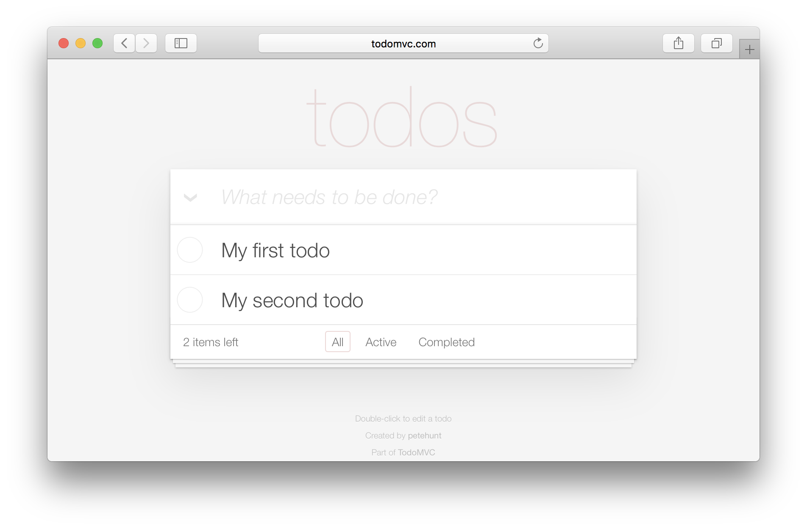
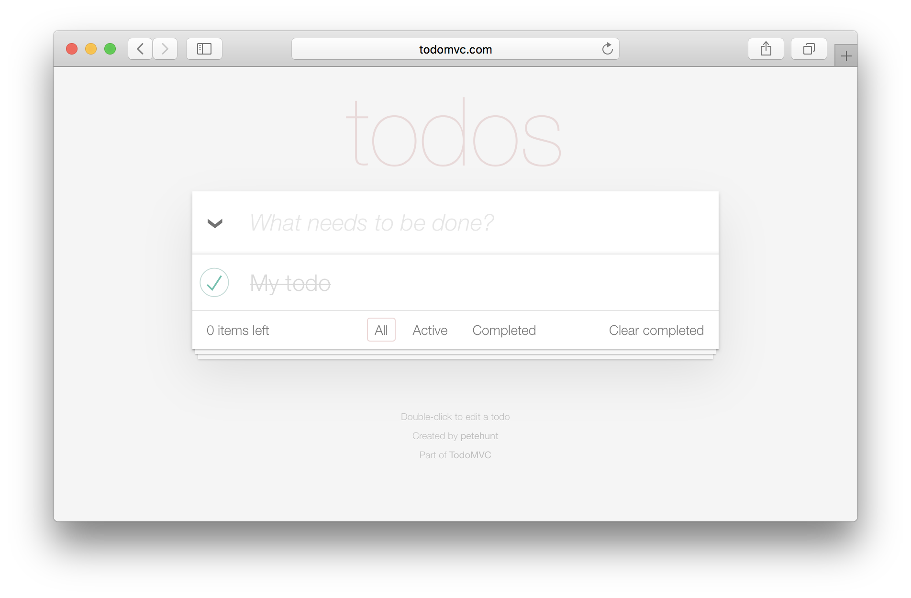

# @pageobject/todomvc

[![Package Version][badge-npm-image]][badge-npm-link]
[![Build Status][badge-travis-image]][badge-travis-link]
[![Coverage Status][badge-coveralls-image]][badge-coveralls-link]
[![TypeScript][badge-typescript-image]][badge-typescript-link]

> An exemplary test suite for the popular [TodoMVC][external-todomvc] application.

**This package is part of [PageObjectJS][internal-homepage].**

## Installation

```sh
yarn add @pageobject/todomvc
```

## Introduction

This project serves as an example implementation. We use [TypeScript][external-typescript] as programming language, [Jest][external-jest] as test runner and perform the tests with [Puppeteer][external-puppeteer] in a headless Chrome. The artifact published on [npm][external-npm] contains all components written for this project.

## Test cases

You can find the **complete code** of all test cases [here](https://github.com/clebert/pageobject/blob/master/@pageobject/todomvc/src/tests/).

### Creating todos



```js
test.perform(app.page.goto('http://todomvc.com/examples/react/#/'), 30);

test
  .assert(app.newTodoInput.hasFocus(), is(true))
  .perform(app.keyboard.type('My first todo'))
  .perform(app.keyboard.press('Enter'))

  .assert(app.newTodoInput.hasFocus(), is(true))
  .perform(app.keyboard.type('My second todo'))
  .perform(app.keyboard.press('Enter'))

  .assert(app.todoList.todos.first().label.getText(), is('My first todo'))
  .assert(app.todoList.todos.last().label.getText(), is('My second todo'));
```

### Completing a todo



```js
test.perform(app.page.goto('http://todomvc.com/examples/react/#/'), 30);

test
  .assert(app.newTodoInput.hasFocus(), is(true))
  .perform(app.keyboard.type('My todo'))
  .perform(app.keyboard.press('Enter'));

const todo = app.todoList.todos.first();

test
  .assert(todo.toggle.isChecked(), is(false))
  .perform(todo.toggle.click())
  .assert(todo.toggle.isChecked(), is(true));
```

## API documentation

Please find the API documentation [here][internal-api-todomvc].

---

Copyright (c) 2017-present, Clemens Akens. Released under the terms of the [MIT License][internal-license].

[badge-coveralls-image]: https://coveralls.io/repos/github/clebert/pageobject/badge.svg?branch=master
[badge-coveralls-link]: https://coveralls.io/github/clebert/pageobject?branch=master
[badge-npm-image]: https://img.shields.io/npm/v/@pageobject/todomvc.svg
[badge-npm-link]: https://yarnpkg.com/en/package/@pageobject/todomvc
[badge-travis-image]: https://travis-ci.org/clebert/pageobject.svg?branch=master
[badge-travis-link]: https://travis-ci.org/clebert/pageobject
[badge-typescript-image]: https://img.shields.io/badge/TypeScript-ready-blue.svg
[badge-typescript-link]: https://www.typescriptlang.org/
[external-jest]: https://facebook.github.io/jest/
[external-npm]: https://www.npmjs.com/
[external-puppeteer]: https://github.com/GoogleChrome/puppeteer
[external-todomvc]: http://todomvc.com/
[external-typescript]: https://www.typescriptlang.org/
[internal-api-todomvc]: https://pageobject.js.org/api/todomvc/
[internal-homepage]: https://pageobject.js.org/
[internal-license]: https://github.com/clebert/pageobject/blob/master/LICENSE
