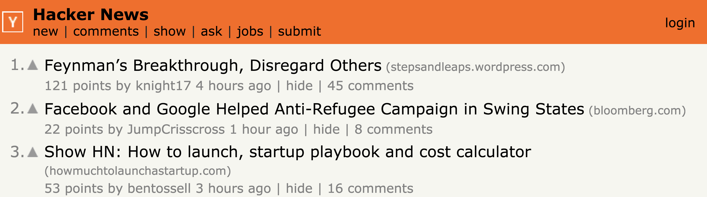
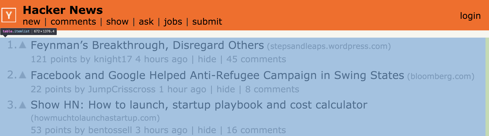
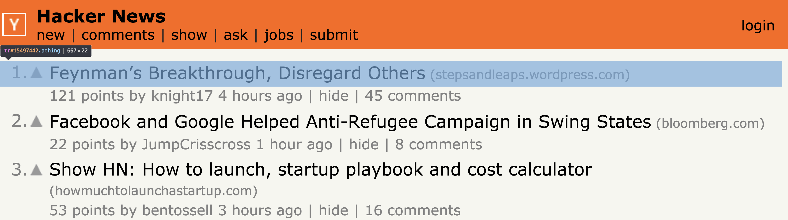
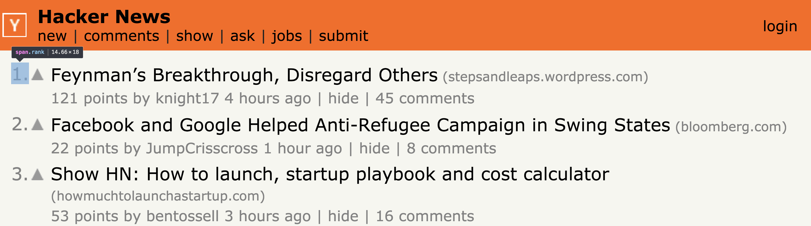
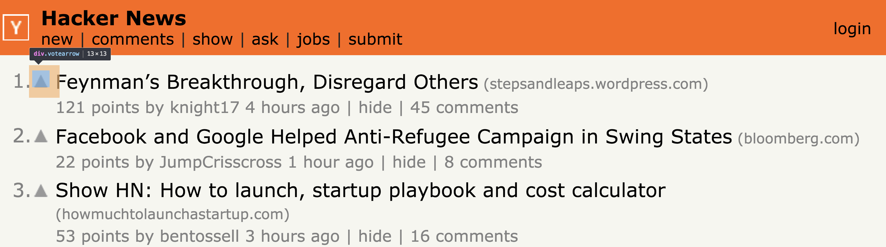
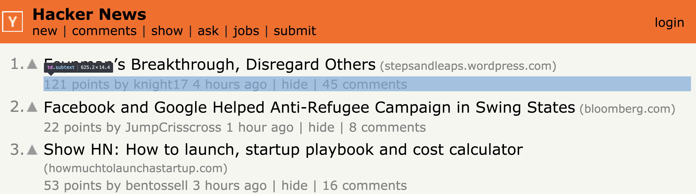
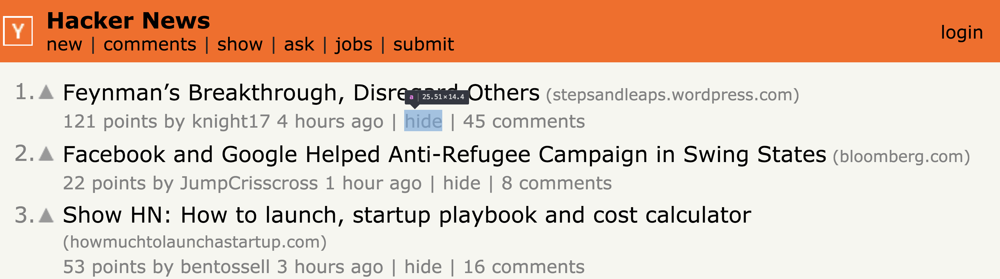
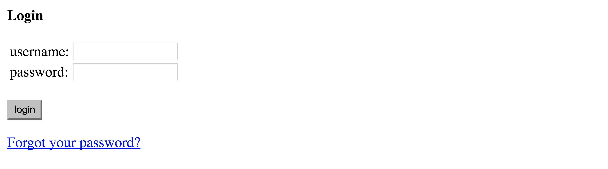

# Example: A test suite for [Hacker News][hackernews]

This example uses [Jest][jest] as test runner and [Selenium][selenium] as browser automation library.

It is written in [TypeScript][typescript], **the entire code can be found [here][example-code-hackernews].**

## Overview

- [Tests](#tests)
- [Page Objects](#page-objects)
  - [Page `FrontPage`](#page-frontpage)
  - [Component `NewsList`](#component-newslist)
  - [Component `NewsItem`](#component-newsitem)
  - [Component `NewsSubtext`](#component-newssubtext)
  - [Page `LoginPage`](#page-loginpage)
  - [Page `HideLoginPage`](#page-hideloginpage)
  - [Page `VoteLoginPage`](#page-voteloginpage)

## Tests

```sh
PASS @pageobject/examples/src/hackernews/tests/FrontPage.test.ts (5.057s)
  GIVEN the Hacker News front page is open
    ✓ THEN the displayed rank of a news should match its position in the news list (1435ms)
    WHEN the user is not logged in
      ✓ THEN hiding a news should trigger a redirect to the login page (1495ms)
      ✓ THEN voting a news should trigger a redirect to the login page (1999ms)

Test Suites: 1 passed, 1 total
Tests:       3 passed, 3 total
Snapshots:   0 total
Time:        5.067s, estimated 6s
```

```js
let adapter: SeleniumAdapter;

beforeEach(async () => {
  adapter = await SeleniumAdapter.launchHeadlessChrome();
});

afterEach(async () => {
  await adapter.driver.quit();
});

describe('GIVEN the Hacker News front page is open', () => {
  let frontPage: FrontPage;

  beforeEach(async () => {
    frontPage = await FrontPage.open(adapter);
  });

  test('THEN the displayed rank of a news should match its position in the news list', async () => {
    const newsList = frontPage.selectNewsList();
    const news3 = newsList.selectNews(3);

    expect(await news3.item.getRank()).toBe(3);
  });

  describe('WHEN the user is not logged in', () => {
    test('THEN hiding a news should trigger a redirect to the login page', async () => {
      const newsList = frontPage.selectNewsList();
      const news = newsList.selectNews();

      const loginPage = await news.subtext.hideAsAnonymous();

      expect(
        await loginPage.displaysMessage('You have to be logged in to hide.')
      ).toBe(true);
    });

    test('THEN voting a news should trigger a redirect to the login page', async () => {
      const newsList = frontPage.selectNewsList();
      const news = newsList.selectNews();

      const loginPage = await news.item.voteAsAnonymous();

      expect(
        await loginPage.displaysMessage('You have to be logged in to vote.')
      ).toBe(true);
    });
  });
});
```

## Page Objects

### Page `FrontPage`



```js
class FrontPage extends PageObject<WebElement, SeleniumAdapter> {
  public static selectors = [NewsList.selector];
  public static url = /\/news$/;

  public static async open(adapter: SeleniumAdapter): Promise<FrontPage> {
    return adapter.open(FrontPage, 'https://news.ycombinator.com/news');
  }

  public selectNewsList(): NewsList {
    return this.selectUniqueDescendant(NewsList);
  }
}
```

### Component `NewsList`



```js
interface News {
  readonly item: NewsItem;
  readonly subtext: NewsSubtext;
}

class NewsList extends PageObject<WebElement, SeleniumAdapter> {
  public static selector = 'table.itemlist';

  public selectNews(n: number = 1): News {
    return {
      item: this.selectUniqueDescendant(NewsItem, atIndex(n - 1)),
      subtext: this.selectUniqueDescendant(NewsSubtext, atIndex(n - 1))
    };
  }
}
```

### Component `NewsItem`



```js
class NewsItem extends PageObject<WebElement, SeleniumAdapter> {
  public static selector = 'tr.athing';
```

#### Descendant Element `span.rank`



```js
  public async getRank(): Promise<number> {
    const element = await this.findUniqueDescendant('span.rank');

    return parseInt(await element.getText(), 10);
  }
```

#### Descendant Element `div.votearrow`



```js
  public async vote(): Promise<void> {
    const element = await this.findUniqueDescendant('div.votearrow');

    await element.click();
  }

  public async voteAsAnonymous(): Promise<VoteLoginPage> {
    await this.vote();

    return await this.goto(VoteLoginPage);
  }
}
```

### Component `NewsSubtext`



```js
class NewsSubtext extends PageObject<WebElement, SeleniumAdapter> {
  public static selector = 'td.subtext';
```

#### Descendant Element `a` + `textEquals('hide')`



```js
  public async hide(): Promise<void> {
    const element = await this.findUniqueDescendant('a', textEquals('hide'));

    await element.click();
  }

  public async hideAsAnonymous(): Promise<HideLoginPage> {
    await this.hide();

    return await this.goto(HideLoginPage);
  }
}
```

### Page `LoginPage`



```js
const selectors = [
  'input[type="submit"][value="login"]',
  'input[type="submit"][value="create account"]'
];
```

```js
class LoginPage extends PageObject<WebElement, SeleniumAdapter> {
  public static selectors = selectors;
  public static url = /login/;

  public async displaysMessage(message: string): Promise<boolean> {
    const element = await this.findSelf();
    const html = await element.getText();

    return html.indexOf(message) > -1;
  }
}
```

### Page `HideLoginPage`


```js
class HideLoginPage extends LoginPage {
  public static selectors = selectors;
  public static url = /hide\?id=[0-9]+/;
}
```

### Page `VoteLoginPage`


```js
class VoteLoginPage extends LoginPage {
  public static selectors = selectors;
  public static url = /vote\?id=[0-9]+/;
}
```

[example-code-hackernews]: https://github.com/clebert/pageobject/tree/master/@pageobject/examples/src/hackernews

[hackernews]: https://news.ycombinator.com/news
[jest]: http://facebook.github.io/jest/
[selenium]: http://seleniumhq.github.io/selenium/docs/api/javascript/index.html
[typescript]: https://www.typescriptlang.org/
