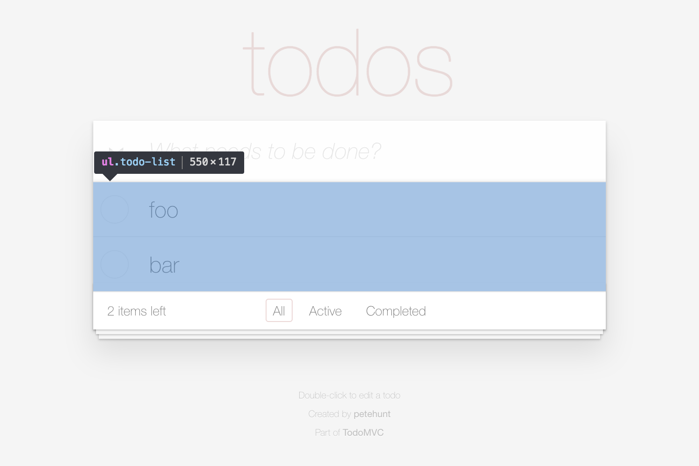

# Tutorial: TodoMVC

In this tutorial we write a test case for the [TodoMVC][external-todomvc] application.
We will create several page objects and learn about different design principles.


*You can find the complete code for this example [here][internal-example-code-todo-mvc].*
*It can be executed with Node.js 8 or higher.*

## Page objects

- [TodoApp](#page-object-todoapp)
- TodoApp > [NewTodo](#page-object-newtodo)
- TodoApp > [TodoList](#page-object-todolist)
- TodoApp > TodoList > [Todo](#page-object-todo)[ ]
- TodoApp > TodoList > Todo[ ] > [Label](#page-object-label)
- TodoApp > TodoList > Todo[ ] > [Toggle](#page-object-toggle)

## Test case

```js
function describe(testCase, todoApp) {
  const todo1 = todoApp.todoList.todos.nth(1);
  const todo2 = todoApp.todoList.todos.nth(2);

  testCase
    .perform(todoApp.navigateTo('http://todomvc.com/examples/react/#/'), 30)

    .assert(todoApp.newTodo.hasFocus())

    .perform(todoApp.newTodo.type('foo'))
    .perform(todoApp.newTodo.sendKey(FlexibleKey.ENTER))
    .assert(todo1.label.getRenderedText(equals('foo')))

    .perform(todoApp.newTodo.type('bar'))
    .perform(todoApp.newTodo.sendKey(FlexibleKey.ENTER))
    .assert(todo2.label.getRenderedText(equals('bar')))

    .assert(todo2.toggle.isSelected(equals(false)))
    .perform(todo2.toggle.click())
    .assert(todo2.toggle.isSelected());
}
```

## Page object: TodoApp


### Choosing a CSS selector

```html
<html> <!-- Absolute root -->
  <body>
    <section class="todoapp"> <!-- TodoApp -->
```

### Implementing the page object

```js
class TodoApp extends FlexiblePageObject {
  get selector() {
    return '.todoapp';
  }
}
```

## Page object: NewTodo


### Choosing a CSS selector

```html
<section class="todoapp"> <!-- Relative root (TodoApp) -->
  <div>
    <header class="header">
      <input class="new-todo"> <!-- NewTodo -->
```

### Implementing the page object

```js
class NewTodo extends FlexiblePageObject {
  get selector() {
    return '.new-todo';
  }
}
```

### Integrating the page object

```js
class TodoApp extends FlexiblePageObject {
  get selector() {
    return '.todoapp';
  }

  get newTodo() {
    return this.select(NewTodo);
  }
}
```

## Page object: TodoList



### Choosing a CSS selector

```html
<section class="todoapp"> <!-- Relative root (TodoApp) -->
  <div>
    <section class="main">
      <ul class="todo-list"> <!-- TodoList -->
```

### Implementing the page object

```js
class TodoList extends FlexiblePageObject {
  get selector() {
    return '.todo-list';
  }
}
```

### Integrating the page object

```js
class TodoApp extends FlexiblePageObject {
  get selector() {
    return '.todoapp';
  }

  get newTodo() {
    return this.select(NewTodo);
  }

  get todoList() {
    return this.select(TodoList);
  }
}
```

## Page object: Todo


### Choosing a CSS selector

```html
<ul class="todo-list"> <!-- Relative root (TodoList) -->
  <li> <!-- Todo -->
  <li> <!-- Todo -->
  ....
```

### Implementing the page object

```js
class Todo extends FlexiblePageObject {
  get selector() {
    return 'li';
  }
}
```

### Integrating the page object

```js
class TodoList extends FlexiblePageObject {
  get selector() {
    return '.todo-list';
  }

  get todos() {
    return this.select(Todo);
  }
}
```

### Using the page object

```js
todoApp.todoList.todos.nth(1);
```

```js
todoApp.todoList.todos.where(todo => todo.label.getRenderedText(equals('foo')));
```

## Page object: Label


### Choosing a CSS selector

```html
<li> <!-- Relative root (Todo) -->
  <div class="view">
    <label> <!-- Label -->
```

### Implementing the page object

```js
class Label extends FlexiblePageObject {
  get selector() {
    return 'label';
  }
}
```

### Integrating the page object

```js
class Todo extends FlexiblePageObject {
  get selector() {
    return 'li';
  }

  get label() {
    return this.select(Label);
  }
}
```

## Page object: Toggle


### Choosing a CSS selector

```html
<li> <!-- Relative root (Todo) -->
  <div class="view">
    <input class="toggle" type="checkbox"> <!-- Toggle -->
```

### Implementing the page object

```js
class Toggle extends FlexiblePageObject {
  get selector() {
    return '.toggle';
  }

  isSelected(operator = equals(true)) {
    return this.getProperty('checked', operator);
  }
}
```

### Integrating the page object

```js
class Todo extends FlexiblePageObject {
  get selector() {
    return 'li';
  }

  get label() {
    return this.select(Label);
  }

  get toggle() {
    return this.select(Toggle);
  }
}
```

[internal-example-code-todo-mvc]: https://github.com/clebert/pageobject/blob/master/docs/examples/todo-mvc/index.js

[external-todomvc]: http://todomvc.com/examples/react/#/
