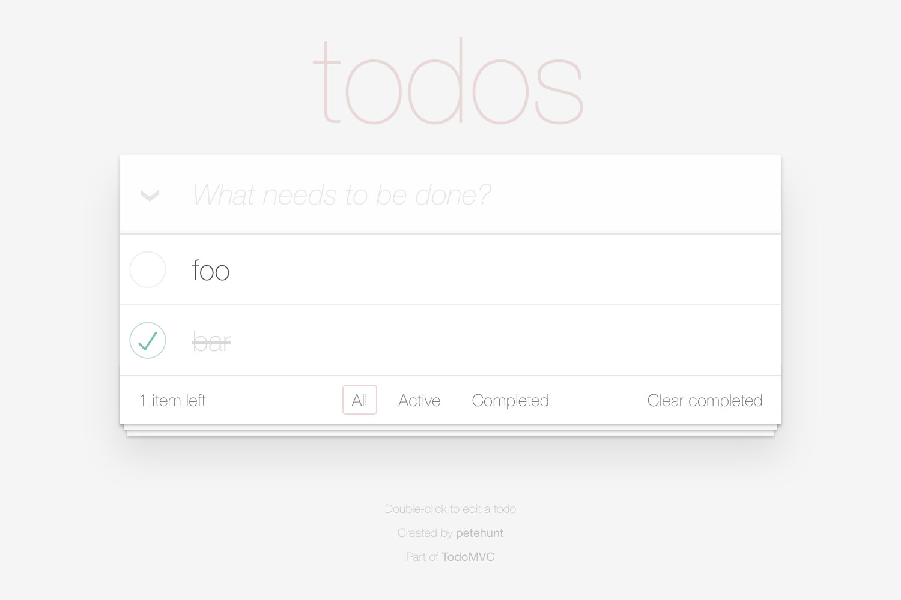

# Example: TodoMVC



## Page objects

- [TodoApp](./page-objects/1-todo-app.md)
- TodoApp > [NewTodo](./page-objects/2-new-todo.md)
- TodoApp > [TodoList](./page-objects/3-todo-list.md)
- TodoApp > TodoList > [Todo](./page-objects/4-todo.md)[ ]
- TodoApp > TodoList > Todo[ ] > [Label](./page-objects/5-label.md)
- TodoApp > TodoList > Todo[ ] > [Toggle](./page-objects/6-toggle.md)

## Test case

```js
function describe(testCase, todoApp) {
  const todo1 = todoApp.todoList.todos.nth(1);
  const todo2 = todoApp.todoList.todos.nth(2);

  testCase
    .perform(todoApp.navigateTo('http://todomvc.com/examples/react/#/'), 30)

    .assert(todoApp.newTodo.hasFocus())

    .perform(todoApp.newTodo.type('foo'))
    .perform(todoApp.newTodo.sendKey(FlexibleKey.ENTER))
    .assert(todo1.label.getRenderedText(equals('foo')))

    .perform(todoApp.newTodo.type('bar'))
    .perform(todoApp.newTodo.sendKey(FlexibleKey.ENTER))
    .assert(todo2.label.getRenderedText(equals('bar')))

    .assert(todo2.toggle.isSelected(equals(false)))
    .perform(todo2.toggle.click())
    .assert(todo2.toggle.isSelected());
}
```
