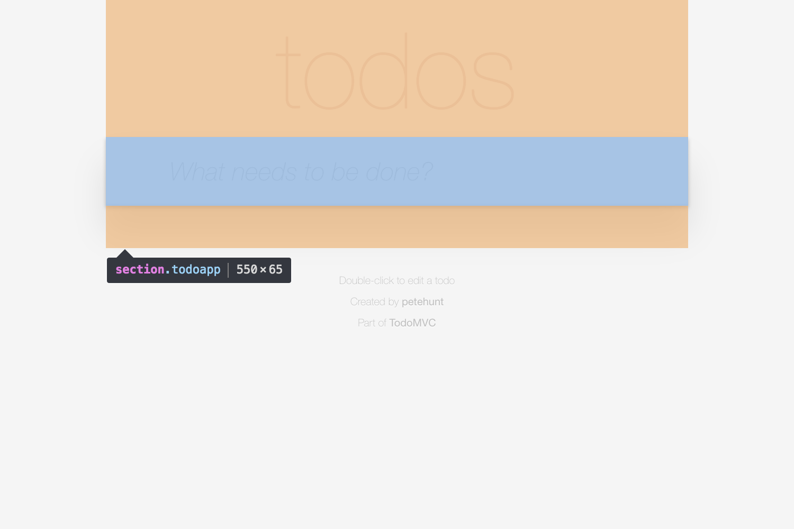

# Example: TodoMVC

In this example we write a [test case](../index.md#test-case) for the [TodoMVC][external-todomvc] application.

## Page objects

- **TodoApp**
- TodoApp > [NewTodo](./2-new-todo.md#page-object-newtodo)
- TodoApp > [TodoList](./3-todo-list.md#page-object-todolist)
- TodoApp > TodoList > [Todo](./4-todo.md#page-object-todo)[ ]
- TodoApp > TodoList > Todo[ ] > [Label](./5-label.md#page-object-label)
- TodoApp > TodoList > Todo[ ] > [Toggle](./6-toggle.md#page-object-toggle)

## Page object: TodoApp



### Choosing a CSS selector

```html
<html> <!-- Absolute root -->
  <body>
    <section class="todoapp"> <!-- TodoApp -->
```

### Implementing the page object

```js
class TodoApp extends FlexiblePageObject {
  get selector() {
    return '.todoapp';
  }
}
```

[external-todomvc]: http://todomvc.com/examples/react/#/
