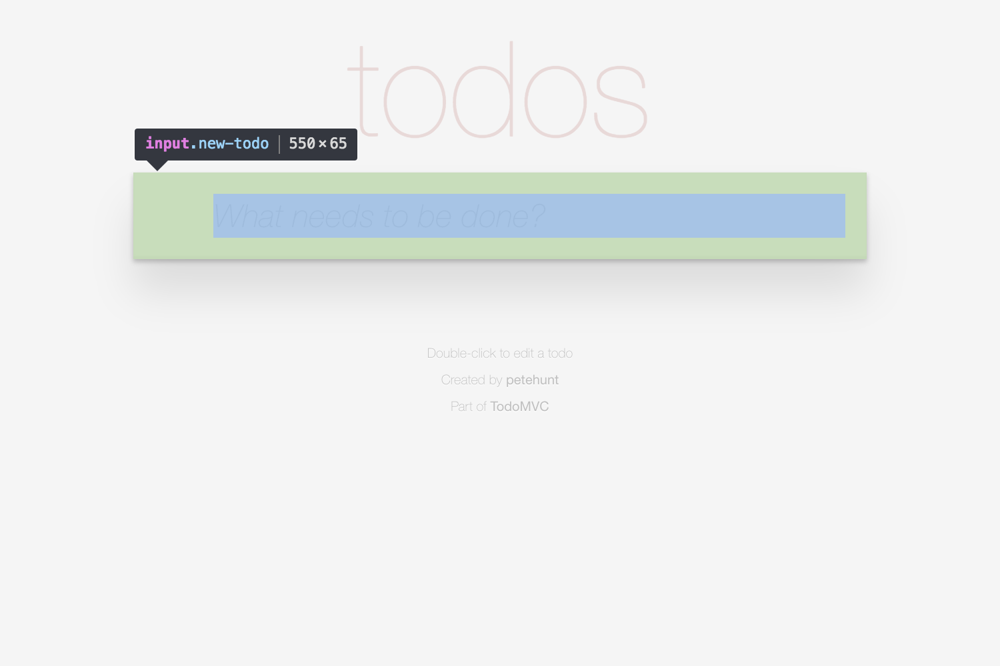

# Page object: `TodoApp` > `NewTodo`



## Choosing a CSS selector

```html
<section class="todoapp"> <!-- TodoApp (relative root) -->
  <div> <!-- No page object (implementation detail) -->
    <header class="header"> <!-- No page object (implementation detail) -->
      <input class="new-todo"> <!-- NewTodo -->
```

## Implementing the page object

```js
class NewTodo extends FlexiblePageObject {
  get selector() {
    return '.new-todo';
  }
}
```

## Integrating the page object

```js
class TodoApp extends FlexiblePageObject {
  get selector() {
    return '.todoapp';
  }

  get newTodo() {
    return this.select(NewTodo);
  }
}
```
