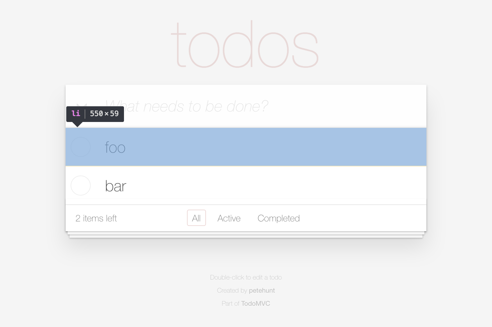

# Page object: TodoApp > TodoList > Todo[ ]



## Choosing a CSS selector

```html
<ul class="todo-list"> <!-- TodoList (relative root) -->
  <li> <!-- Todo -->
  <li> <!-- Todo -->
  ....
```

## Implementing the page object

```js
class Todo extends FlexiblePageObject {
  get selector() {
    return 'li';
  }
}
```

## Integrating the page object

```js
class TodoList extends FlexiblePageObject {
  get selector() {
    return '.todo-list';
  }

  get todos() {
    return this.select(Todo);
  }
}
```

## Using the page object

```js
todoApp.todoList.todos.nth(1);
```

```js
todoApp.todoList.todos.where(todo => todo.label.getRenderedText(equals('foo')));
```
