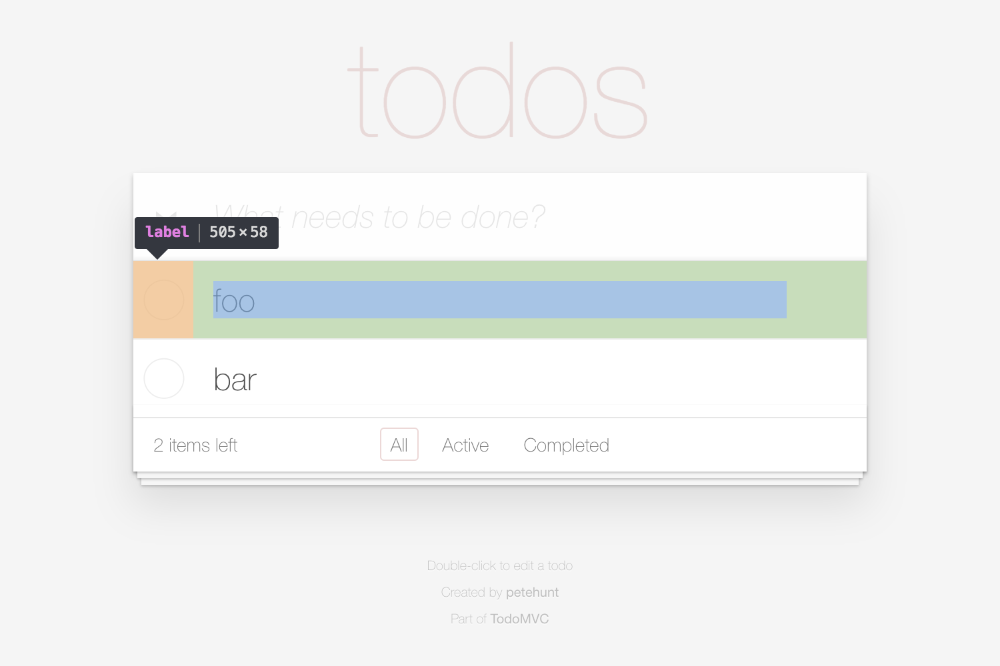

# Page object: TodoApp > TodoList > Todo[ ] > Label



## Choosing a CSS selector

```html
<li> <!-- Todo (relative root) -->
  <div class="view"> <!-- No page object (implementation detail) -->
    <label> <!-- Label -->
```

## Implementing the page object

```js
class Label extends FlexiblePageObject {
  get selector() {
    return 'label';
  }
}
```

## Integrating the page object

```js
class Todo extends FlexiblePageObject {
  get selector() {
    return 'li';
  }

  get label() {
    return this.select(Label);
  }
}
```
