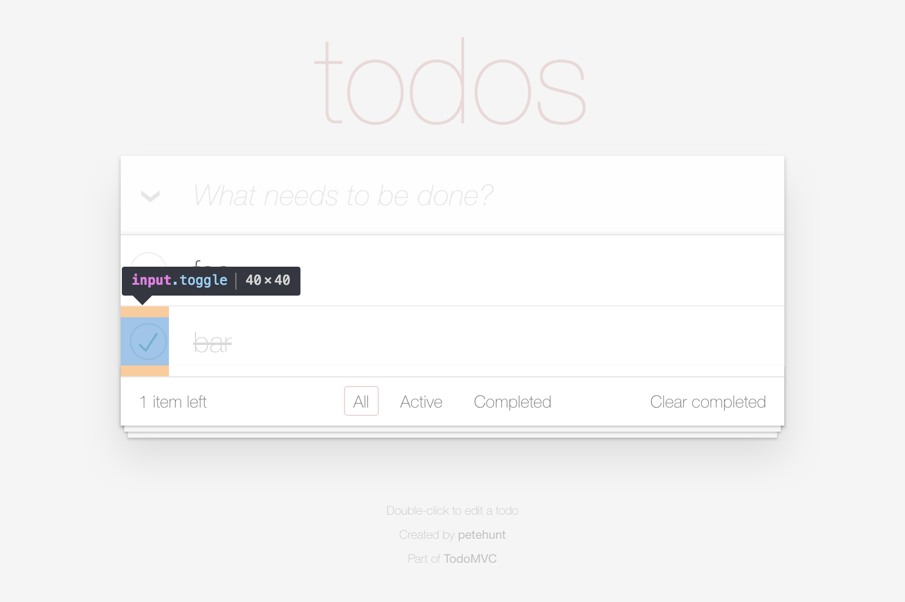

# Page object: `TodoApp` > `TodoList` > `Todo`[ ] > `Toggle`



## Choosing a CSS selector

```html
<li> <!-- Todo (relative root) -->
  <div class="view"> <!-- No page object (implementation detail) -->
    <input class="toggle" type="checkbox"> <!-- Toggle -->
```

## Implementing the page object

```js
class Toggle extends FlexiblePageObject {
  get selector() {
    return '.toggle';
  }

  isSelected(operator = equals(true)) {
    return this.getProperty('checked', operator);
  }
}
```

## Integrating the page object

```js
class Todo extends FlexiblePageObject {
  get selector() {
    return 'li';
  }

  get label() {
    return this.select(Label);
  }

  get toggle() {
    return this.select(Toggle);
  }
}
```
