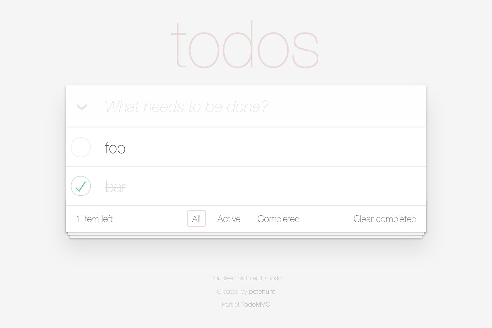

# PageObjectJS

## Getting started

In this example we navigate to [example.com][external-example-domain] and assert that the page title equals "Example Domain".

```js
class Page extends FlexiblePageObject {
  get selector() {
    return ':root'; // https://developer.mozilla.org/en-US/docs/Web/CSS/:root
  }
}

function describe(testCase, page) {
  testCase
    .perform(page.navigateTo('http://example.com/'))
    .assert(page.getPageTitle(equals('Example Domain')));
}
```

*You can find the complete code for this example [here][internal-example-code-getting-started].*
*It can be executed with Node.js 8 or higher.*

## Example: TodoMVC

In this example we write a test case for the TodoMVC application.



You can find the step-by-step instructions [here](./examples/todo-mvc/index.md).

[internal-example-code-getting-started]: https://github.com/clebert/pageobject/tree/master/docs/examples/getting-started.js

[external-example-domain]: http://example.com/
